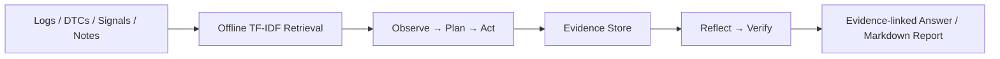

# DriveOpsAgent

An offline, evidence-first **Autonomous Driving Test & Fault Analysis AI Agent**. It is an agentic workflow—not a one-question chatbot—for inspecting logs, DTCs, validation notes, and signals before producing a verifiable conclusion.

> This is an engineering/portfolio project and not a production autonomous-driving safety system.



## Agent loop

`Observe → Plan → Act → Observe → Reflect → Verify → Answer`. The planner creates a multi-step plan and records plan revision when evidence changes the investigation. Execution is step-bounded and tool-call results are cached for the task session.

## Tools and safety

- `search_docs`, `read_log`, `query_dtcs`, `calculate_metric`, and `generate_report` are Pydantic-validated tools.
- Metrics use explicit operations—never `eval`.
- Files are confined to `data/` and `reports/`; report filename traversal is rejected.
- Retrieval content is treated as untrusted data, including an injection fixture.

## RAG and evidence

Validation documents are chunked, indexed by a deterministic offline lexical TF-IDF-like scorer, then retrieved with `source_id`, `chunk_id`, `score`, and `content`. Each conclusion is accompanied by `Evidence` records containing source, tool, artifact, field/snippet and confidence. The verifier marks unsupported work uncertain.

## Run

```bash
python -m pip install -e '.[dev]'
python -m driveops_agent.cli ingest
python -m driveops_agent.cli run --task "为什么这次制动测试进入 failsafe？" --provider mock
python -m driveops_agent.cli eval
```

## Evaluation pipeline

`evals/cases.jsonl` contains 12 offline cases spanning failsafe analysis, ranked root cause, comparison, and report generation. The CLI calculates (not hardcodes) task success, tool-selection accuracy, evidence coverage, unsupported-claim rate, average calls and average steps, writing `reports/v1_eval.json` and `reports/v1_eval.md`.

| Metric | V1 source |
|---|---|
| Task success | Generated by `cli eval` |
| Unsupported-claim rate | Generated by verifier-backed eval |

## Known limitations

V1 uses fixture data and deterministic rules, with no external vector DB, web access, MCP, Web UI, multi-agent orchestration, long-term memory, or vehicle deployment. `OpenAICompatibleProvider` is configuration-only and deliberately unused in offline CI; it reads `API_KEY`, `BASE_URL`, and `MODEL` only from the environment.

CI: GitHub Actions runs offline lint, tests, evaluation, and CLI smoke checks on pushes and pull requests.

CI trigger note: a documentation-only change can be used to verify repository Actions execution.
## V1 engineering properties

The Agent asks its provider for a structured, task-derived plan. Every plan step carries an objective, tool, arguments, expected observation, and status. Tool observations can revise the plan, and the mock provider supplies deterministic input-dependent plans and synthesis for offline CI. The OpenAI-compatible provider performs a real chat-completions HTTP request when explicitly selected.

RAG chunks from multiple local documents are untrusted data. Retrieved chunks are attached as evidence and used in root-cause claims; injected content never changes the tool policy. Final answers contain claim IDs, evidence links, confidence, and uncertainty. The verifier checks each link, source identity, DTC support, numerical signal evidence, and conflicts.

Evaluation compares actual tools to expected/forbidden tools, final-claim evidence links to required evidence, and expected root-cause keywords. It reports task success, tool-selection accuracy, evidence coverage, unsupported-claim rate, and hallucinated-source rate from real executions. CI enforces the configured quality thresholds; do not treat any historical percentage as a promise.
